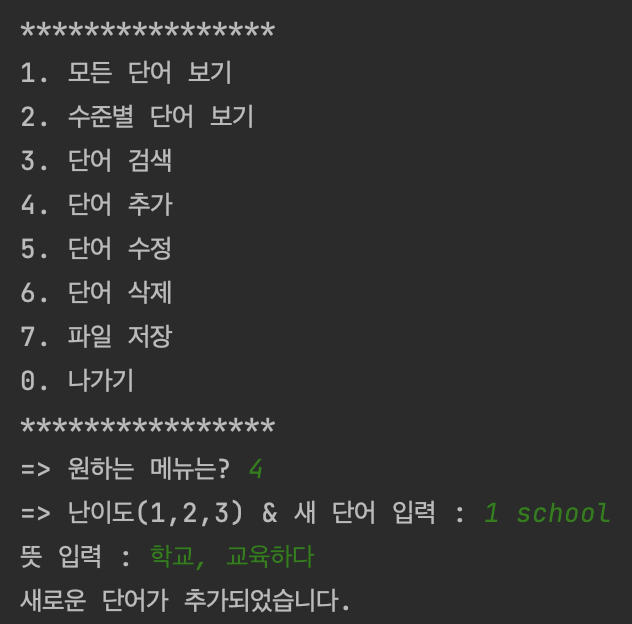
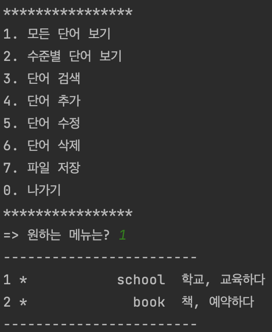

# 실전프로젝트1

### IDE개발환경 사진(intellij)

### 실행화면[4. 단어추가]

### 실행화면[1. 모든 단어보기]

### 실행화면[0. 나가기]

### 실행화면[2. 수준별 단어 보기]  

### 실행화면[3. 단어 검색]  

### 실행화면[5. 단어 수정]

### 실행화면[6. 단어 삭제]
  
apple을 삭제하였기 때문에 찾아볼 수 없다.  
  
### 실행화면[7. 파일 저장]

### 데이터 파일 내용

### 데이터 수정,저장후 로드  

